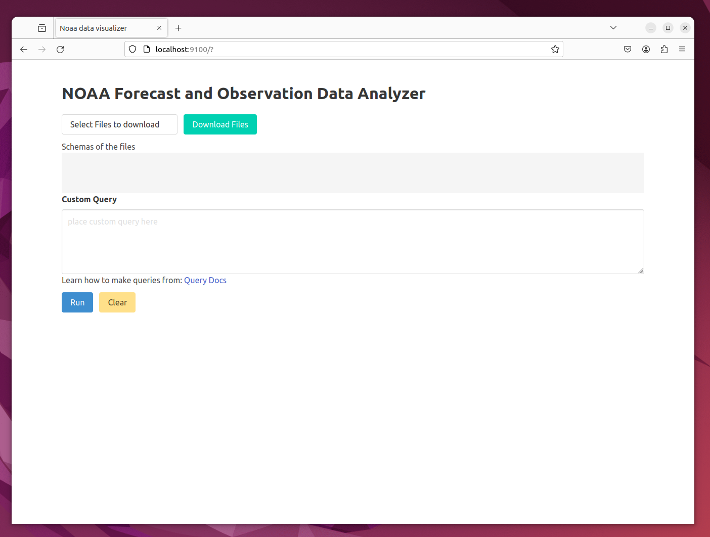
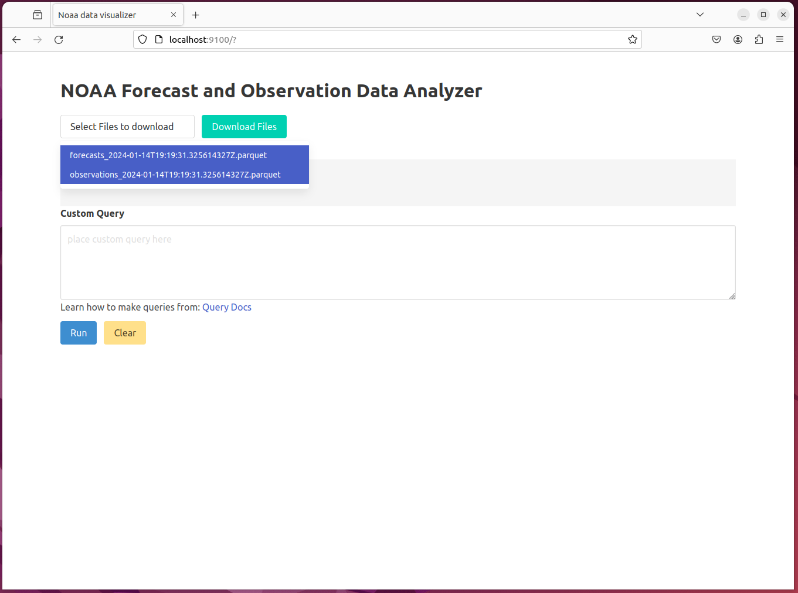
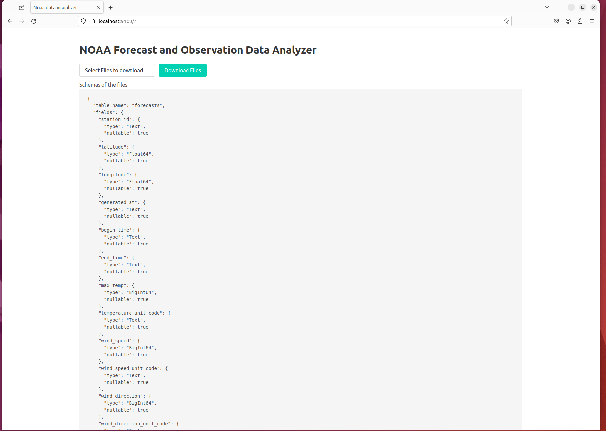
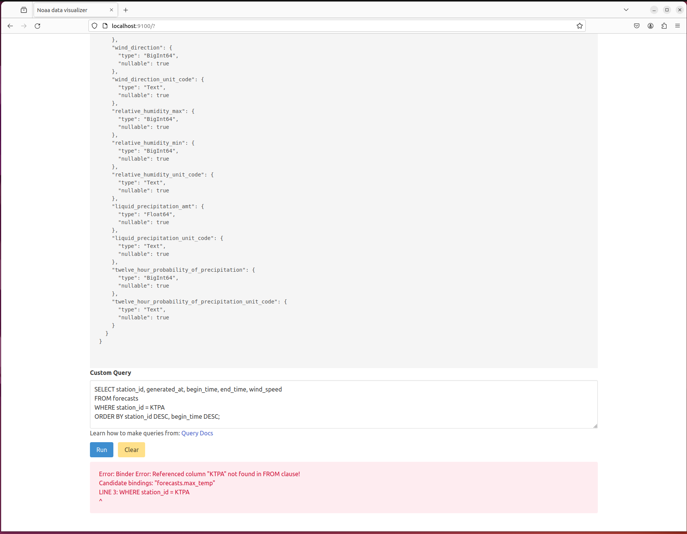
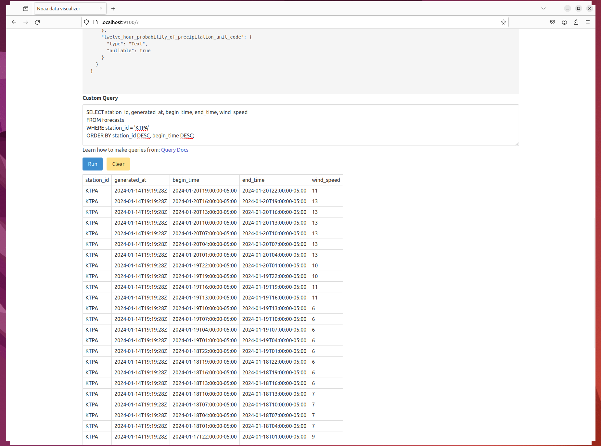

## A simple system showing how to create a data pipeline from NOAA
- Live site located at: [4casttruth.win](https://www.4casttruth.win/)
- Feel free to pull the parquet files and use in your own data analysis (python is a good choice to do this with)

### Example of using the UI:







### Where data comes from:
- Info on where the data used to generate the parquet files comes from:
    - Observations: https://madis.ncep.noaa.gov/madis_metar.shtml accessed via https://aviationweather.gov/data/api/
    - Forecasts (Multiple Point Un-summarized Data): https://graphical.weather.gov/xml/rest.php
- These xml data files are updated once an hour by NOAA, so to be respectful of their services we run our data pulling process once an hour as well

### How the system works:
- daemon:
    - Background process to pull down data from NOAA and transform it into flatted parquet files. These files are then pushed to the `parquet_file_service` via the REST endpoint `POST http://localhost:9100/file` (via multipart form)
- parquet_file_service:
    - A REST API that takes in the parquet files and allows downloading of them from a bones browser UI that is also hosted by the api.
- ui:
    - Holds the browser UI that's just an index.html and main.js file. It uses `@duckdb/duckdb-wasm` to allow the end user to query directly against the download parquet files
    - It uses `https://bulma.io/` for css styling

### Why build a data pipeline like this:
- No remote DB needed, only a dumb file server, makes this cheap to run
- Faster and more flexible querying ability provided to the end user, allowing them to find unique insights that the original system design may not be looking to find
- Each piece is a 'simple' logical item, allowing for scalability for however large the usage is on the service
- Would NOT recommend using this approach if the data being tracked needs to be updated in the parquet files and stored as a relational model, only really works if the data model can be snapshots and immutable over time


### Data Pipeline Process (arrows in direction of who initiates the talking): 
```
[noaa api] <- [daemon] -> parquet files -> [parquet_file_service] <- parquet files <- [browser duck_db]
```

### How to use:
- [Daemon](./daemon/README.md)
- [Parquet_file_service](./parquet_file_service/README.md)
- [Browser](./ui/README.md)
